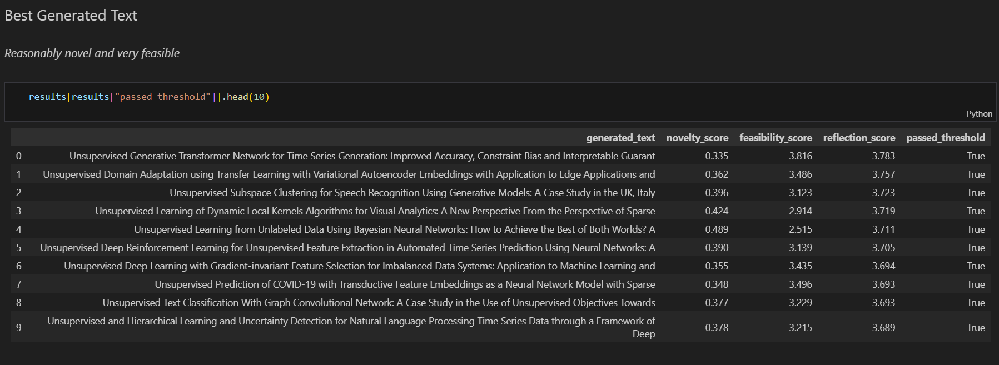
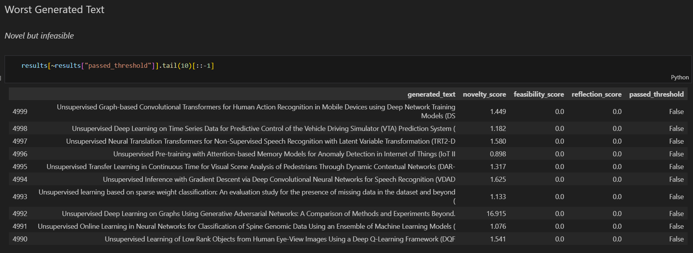

# 🪞 Generative Reflections
A two-model system for reasonable text generation (via vector scoring)

## Overview

*"Think before you speak"*

This repo demonstrates how to use two language models (LMs) to achieve more lucid and coherent text generations.

## Sample Results (Generating ML Ideas)

*...these best scoring texts are given output priority:*

*...these worst scoring ones get filtered out:*

## Models
1. `Causal-LM` for text generation (e.g. [`distilgpt2`](https://huggingface.co/distilbert/distilgpt2))
2. `Masked-LM` for generated text criticism (e.g. [`distilroberta`](https://huggingface.co/distilbert/distilroberta-base))

## Steps
1. Select a specific domain to build generators for (e.g. Machine Learning Ideas)
2. Acquire a text corpus for the domain at hand (e.g. [`aalksii/ml-arxiv-papers`](https://huggingface.co/datasets/aalksii/ml-arxiv-papers))
3. Fine-tune the `Causal-LM` on the corpus (e.g. [finetune_causal.ipynb](finetune_causal.ipynb))
4. Fine-tune the `Masked-LM` on the corpus (e.g. [finetune_masked.ipynb](finetune_masked.ipynb))
5. Acquire and check quality of `Masked-LM` vectors on the corpus and save them (e.g. [vectors.ipynb](vectors.ipynb))
6. Determine the generation objective of the `Causal-LM` w.r.t. the embeddings of the `Masked-LM`; for example:
    - **Novelty:** generated ML idea should be at least `0.05` cosine distance away from any existing idea vector
    - **Feasibility:** generated ML idea should not be too isolated; it should have at least `10` neighbors within `0.1` cosine distance away
7. Generate texts from `Causal-LM`; only output those that pass the objective. (e.g. [generation.ipynb](generation.ipynb))

## Future Work
There is potential for Reinforcement Learning-inspired improvements that could be made here.
